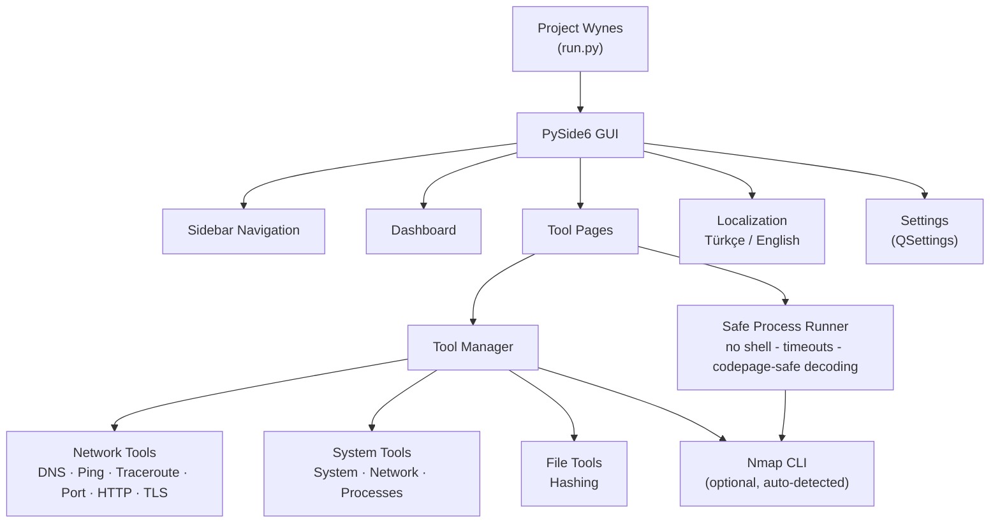

<!-- Banner: the maintainer will add docs/images/banner.png and link it here. -->

<div align="center">

# Project Wynes

**Modern Windows desktop toolkit for defensive network and system diagnostics.**


[Features](#features) ·
[Install](#install) ·
[Usage](#usage) ·
[Architecture](#architecture) ·
[Development](#development)

</div>

---

## Overview

Project Wynes puts everyday diagnostic work — DNS, ping, traceroute, port
checks, HTTP/TLS inspection, Nmap scans, system and process information,
file hashing — into **one clean desktop application** instead of a dozen
terminals and memorized command flags.

It is built for technicians, students and administrators who want answers
quickly, locally, and with a professional bilingual (Türkçe / English)
interface.

> **Authorized use only.** Wynes is a defensive diagnostic tool for systems
> and networks you own or are explicitly permitted to inspect. It contains
> no exploitation, credential-theft or attack-automation functionality.

## Screenshots

<!-- Maintainer: add screenshots to docs/images/ and link them here.
     Suggested shots: dashboard, DNS Lookup, a network tool, System
     Information, Settings / language selection.
     Example once files exist:
     
-->

*Screenshots will be added by the maintainer (placeholders live in
`docs/images/`).*

## Features

| Tool | Purpose |
|------|---------|
| **Dashboard** | Tool availability, system summary, quick access |
| **DNS Lookup** | Resolve hostnames (A/AAAA) and run reverse (PTR) lookups |
| **Ping** | Check reachability and latency — parsing works on any OS display language |
| **Traceroute** | Inspect the route toward a destination, hop by hop |
| **Port Check** | Check connectivity to a specific TCP port (open / closed / filtered) |
| **HTTP Headers** | Inspect response headers and redirects without downloading content |
| **TLS / Certificate** | View protocol, cipher and certificate details; verification status included |
| **Nmap Scan** | Optional, authorized network diagnostics via the official Nmap executable |
| **System Information** | OS, CPU, memory, uptime and runtime overview |
| **Network Information** | Adapters, IPv4/IPv6, MACs, gateways, DNS configuration |
| **Process List** | Read-only process table: PID, name, memory, path |
| **File Hash** | SHA-256 / SHA-512 / SHA-1 / MD5, streamed — files never leave the machine |

Design principles: **defensive-only scope**, **local-first privacy**,
**structured results** (with raw output available when you want it), and a
**restrained black/white/gray UI** — no gimmicks.

## Architecture



Everything except `Nmap` is implemented with the Python standard library;
the only runtime dependency is **PySide6**.

## Install

### Method 1 — PowerShell (recommended)

Standalone executable, installed **per user** (no admin, no Python needed):

```powershell
Invoke-WebRequest -Uri "https://raw.githubusercontent.com/Hakitoxx/ProjectWynes/main/install.ps1" -OutFile "$env:TEMP\wynes-install.ps1"
powershell -ExecutionPolicy Bypass -File "$env:TEMP\wynes-install.ps1"
```

What it does:

1. Downloads the official release package from this repository's Releases
2. **Verifies the SHA-256 checksum** before installing
3. Installs to `%LOCALAPPDATA%\ProjectWynes`
4. Adds a small launcher folder to your **user** PATH (never overwrites it)

Then open a **new** terminal and, from any directory, run:

```cmd
projectwynes
```

> The script is short and auditable — read
> [`install.ps1`](install.ps1) before running it, as with any installer.

Uninstalling is equally contained:

```powershell
powershell -ExecutionPolicy Bypass -File "%LOCALAPPDATA%\ProjectWynes\uninstall.ps1"
```

### Method 2 — GitHub ZIP (local, no PATH changes)

Requires **Python 3.11+**; everything stays inside the folder.

1. **Code → Download ZIP** and extract it
2. Open the extracted folder and run:

   ```powershell
   powershell -ExecutionPolicy Bypass -File setup.ps1
   ```

3. Open `cmd` **inside that folder** and type:

   ```cmd
   projectwynes
   ```

(In PowerShell use `.\projectwynes.cmd`.)

## Usage

Once installed via Method 1, the usual session is simply:

```cmd
C:\Users\You> projectwynes
```

- First launch asks for your **language** (Türkçe / English) and remembers it.
- Pick a tool in the sidebar, fill the input card, press **Run / Çalıştır**.
- Results are structured; expand **Raw Output** for the technical detail.

Developer-mode extras:

```powershell
.\.venv\Scripts\python.exe run.py               # normal start
.\.venv\Scripts\python.exe run.py --lang en     # force language for one run
.\.venv\Scripts\python.exe run.py --smoke-test  # headless boot check
```

### Nmap (optional)

Nmap is **not bundled**. If present, Wynes finds it automatically
(Settings allow a custom path). Profile scope is deliberately defensive:
host discovery, quick TCP scan, service detection — single hosts or CIDR
≤ /24 targets only. Get Nmap from <https://nmap.org>.

## Language support

- **Türkçe** — default
- **English**

Chosen on first launch, switchable live in **Settings → Language**
(no restart). All strings live centrally in `src/wynes/locale/`; a test
guarantees both languages stay in sync.

## Development

```powershell
git clone https://github.com/Hakitoxx/ProjectWynes.git
cd ProjectWynes
python -m venv .venv
.\.venv\Scripts\python.exe -m pip install -r requirements.txt
.\.venv\Scripts\python.exe run.py
```

### Testing

```powershell
.\.venv\Scripts\python.exe -m unittest discover -s tests -v
```

104 deterministic tests: localization parity, validators, command
construction & output parsing, loopback port/HTTP/TLS checks, hashing,
system enumeration, and headless GUI smoke tests in both languages.
Nmap-dependent tests self-skip when Nmap is absent.

### Build / packaging

```powershell
.\.venv\Scripts\python.exe -m pip install -r requirements-dev.txt
.\.venv\Scripts\python.exe -m PyInstaller --noconfirm packaging\projectwynes.spec
```

Output: `dist\projectwynes.exe` — a single windowed executable (~46 MB).
GitHub Actions (`.github/workflows/build-windows.yml`) runs this on tags
`v*` and attaches the zipped executable plus its checksum to the release.

### Project structure

<details>
<summary><b>Show the full tree</b></summary>

```
run.py                    Entry point (--smoke-test, --lang)
projectwynes.cmd          Local launcher (Method 2)
setup.ps1 / install.ps1   ZIP bootstrap / PowerShell installer
uninstall.ps1             Removes a Method 1 installation
packaging/                PyInstaller spec + Windows version info
docs/images/              Screenshots & banner (added by maintainer)
requirements*.txt         Runtime (PySide6) / dev (PyInstaller)
src/wynes/
  app.py                  Bootstrap + first-launch language flow
  core/                   i18n, validators, tool contracts, registry,
                          safe process runner, settings
  locale/                 tr.py / en.py string tables
  tools/                  One module per diagnostic tool
  ui/                     main_window, dashboard, tool_page, outputs,
                          settings_page, about_page, first_launch, theme
tests/                    unittest suite
```

</details>

## Project status

| | |
|---|---|
| Version | **1.2.0** |
| State | Actively developed; complete tool suite implemented |

## Security

Wynes is diagnostic software. External processes run without a shell, with
timeouts and validated arguments; console output is decoded
codepage-safely; no secrets are stored or collected. See
[SECURITY.md](SECURITY.md) for responsible disclosure.

## Contributing

Contributions are welcome — see [CONTRIBUTING.md](CONTRIBUTING.md).
Keep the codebase "az ama sağlam": small, readable, tested.

## License

[MIT](LICENSE) — Copyright (c) 2026 Project Wynes contributors.
